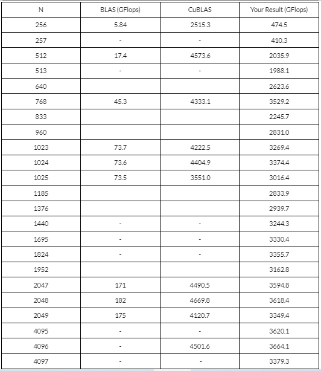
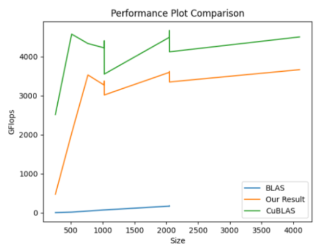
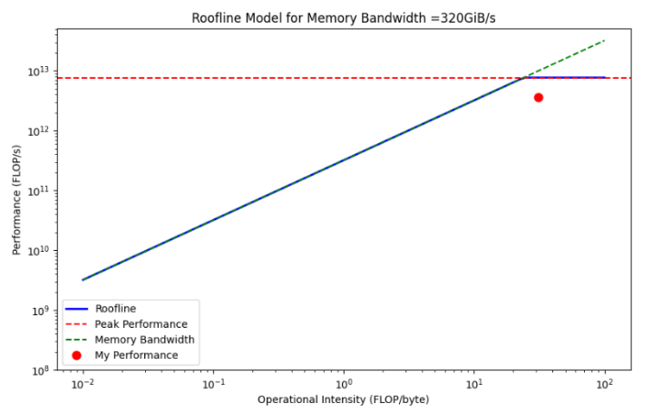

# Optimized-Matrix-Multiplication-on-GPU-with-CUDA

This project aims to optimize the task of matrix multiplication on NVIDIA T104 GPU using Turing architectures To get optimal performance, the tiling algorithm, use of shared memory, thread level, and instruction level parallelism were explored. The [report](Report.pdf) explains all these methods in detail along with performance results.

## Usage

| Task | Command |
| --- | --- |
| Build the binary | `make -C build_T4 'cat src_todo_T4/OPTIONS.txt'` |
| Build the binary with cublas | `make -C build_T4 cublastest=1 'cat src_todo_T4/OPTIONS.txt'` |
| Clean the output files of the make command | `make -C build_T4 clean` |
| Run matrix multiplication | `./mmpy 'cat src_todo_T4/OPTIONS_RUNTIME.txt' -n 256` |
| Run Script in tools folder | `./tools/run_ncu.sh` |
| Fix permission denied error when executing a file | `chmod +x <name_of_file>` |
| Find GPU chipset | `lspci \| grep -i --color 'vga\|3d\|2d'` |

## Results

### Comparison with BLAS and CuBLAS

### Roofline Plot indicating our performance for n = 2048

## References

<ol>
  <li>Andrew Kerr, Duane Merrill, Julien Demouth and John Tran, CUTLASS: Fast Linear Algebra in Cuda C++, December 2017</li>
  <li>Nvidia Cutlass github - https://github.com/NVIDIA/cutlass/blob/master/media/docs/efficient_gemm.md</li>
  <li>Volkov, Demmel, Benchmarking GPUs to Tune Dense Linear Algebra, SC2008</li>
  <li>Volkov, Better Performance at lower Occupancy, GTC2010</li>
  <li>Cuda C++ programming guide - https://docs.nvidia.com/cuda/cuda-c-programming-guide/index.html</li>
  <li>Cuda documentation - https://docs.nvidia.com/cuda/index.html</li>
  <li>Jia, Maggioni, Smith, Scarpazza, ”Dissecting the NVidia Turing T4 GPU via Microbenchmarking”: https://arxiv.org/abs/1903.07486</li>
</ol>